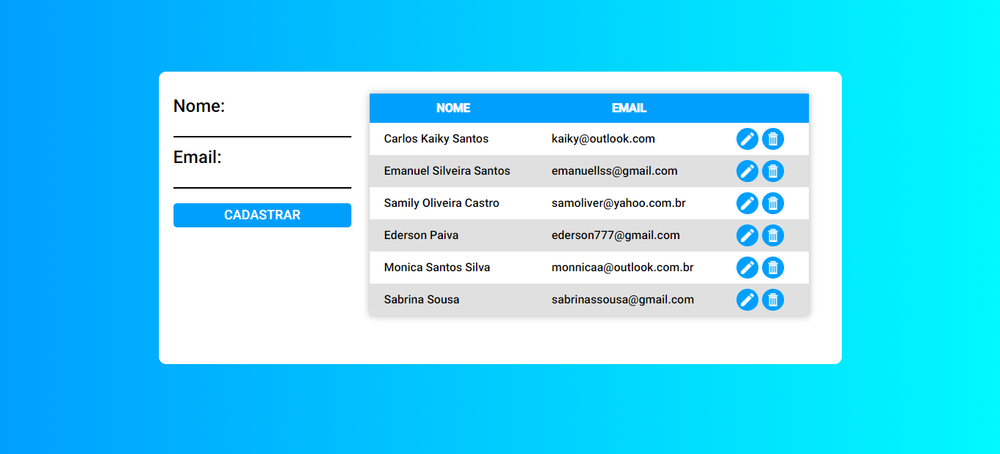

# React.JS CRUD

## 📷 Screenshot:


# :construction_worker: How work ?

```bash
# Clone this repository
$ git clone https://github.com/KaikySantos/reactjs-crud.git
# Access the project folder
$ cd reactjs-crud
```
### 📦 Start API

```bash
# Access the project folder
$ cd backend

# Install the dependencies
$ yarn install

# Run the application
$ yarn start
```
URL: http://localhost:3333/

### 💻 Run the application

```bash
# Access the project folder
$ cd reactjs-crud/frontend

# Install the dependencies
$ yarn install

# Run the application
$ yarn start
```
Go to http://localhost:3000/ to see the result!
